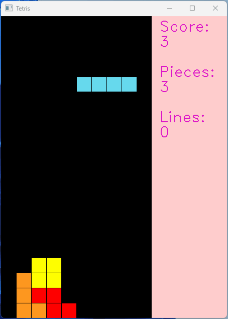
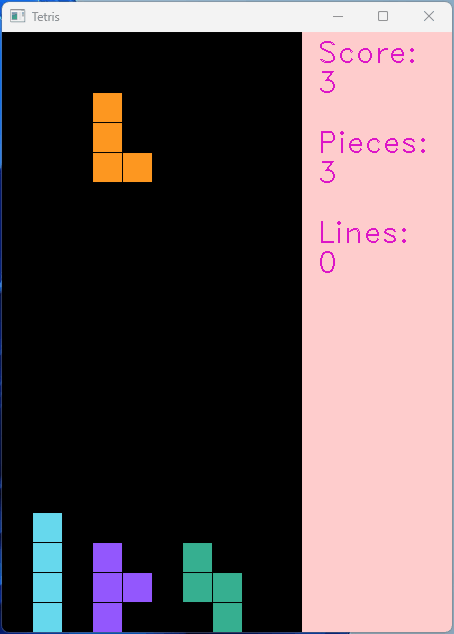
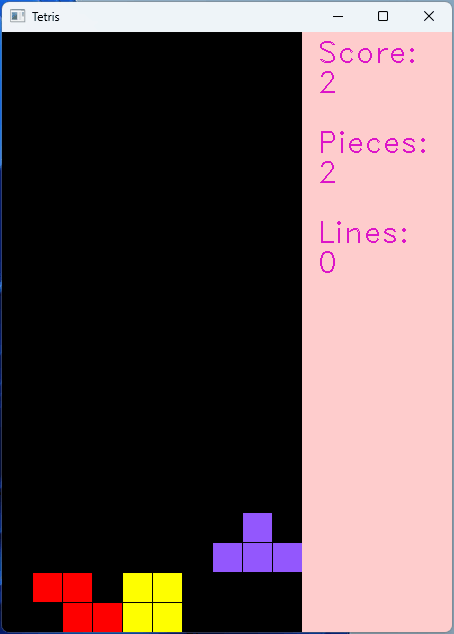
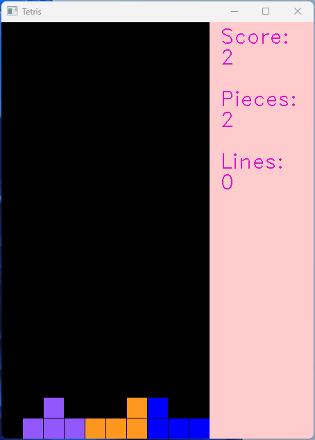
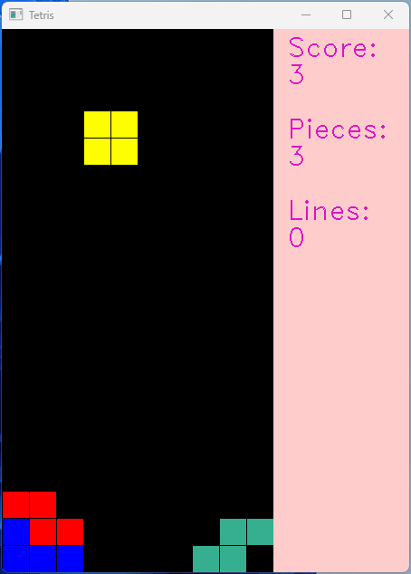
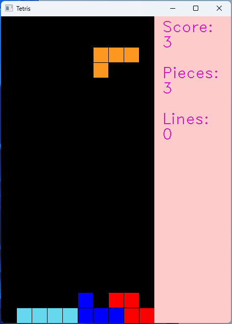
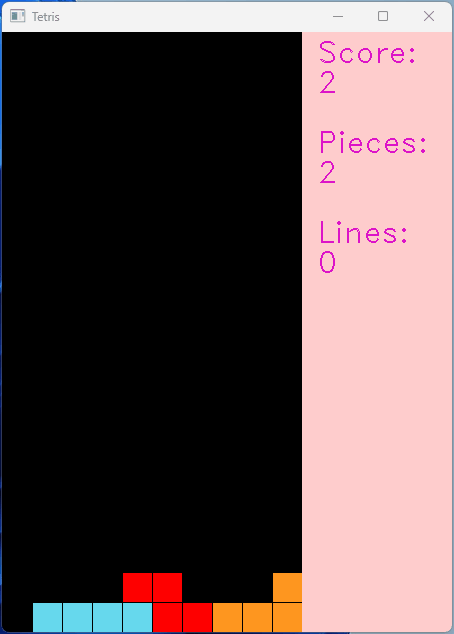
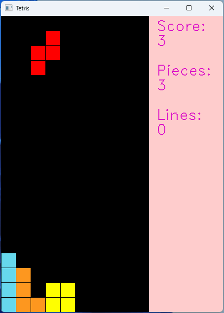
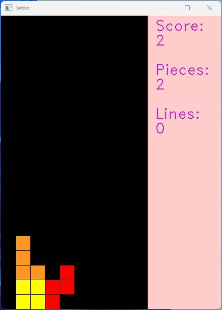

# Tetris Based on DQN

## 项目简介

Reinforcement Learning Lab: Tetris Game Based on Deep Q-Network.

强化学习实验：基于 Deep Q-Network 的俄罗斯方块游戏。



## 项目运行

* 测试模型

  ```bash
  python test.py
  ```

* 训练模型

  ```bash
  python train.py
  ```

* 查看训练数据

  ```bash
  tensorboard --logdir=tensorboard
  ```

## 不同迭代次数表现

<p align="center">
  
  
  
  
  
  <br>300 / 600 / 900 / 1200 / 1500 Iterations<br>
  
  
  
  
  
  <br>1800 / 2100 / 2400 / 2700 / 3000 Iterations<br>
</p>