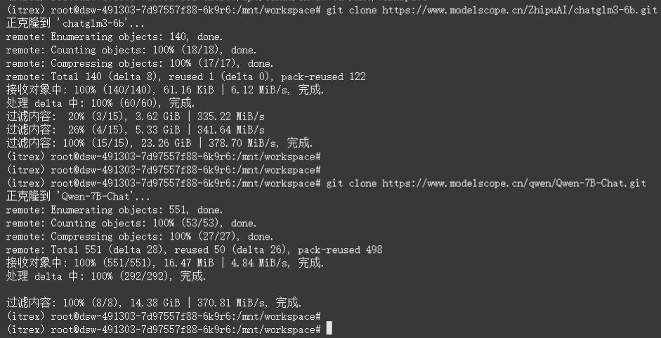
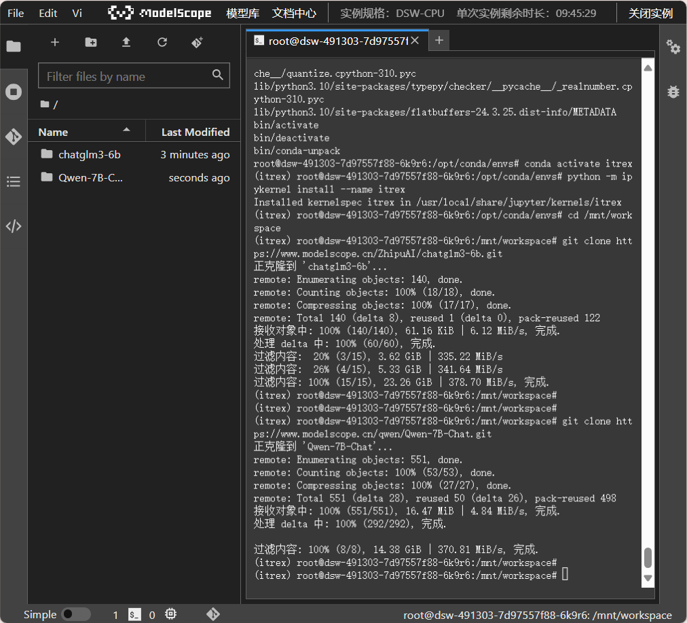
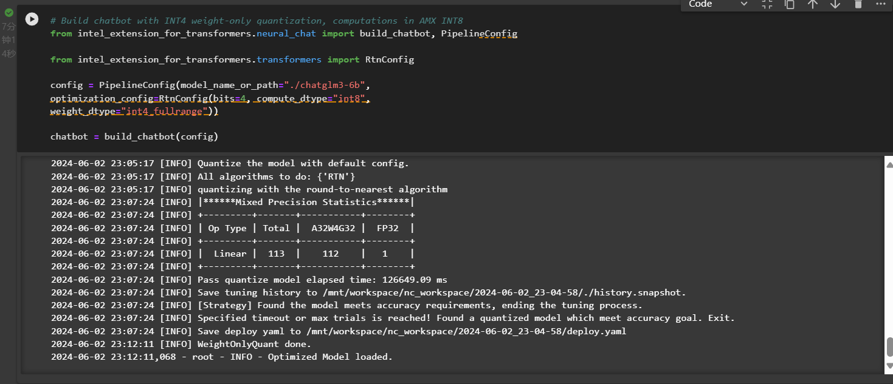
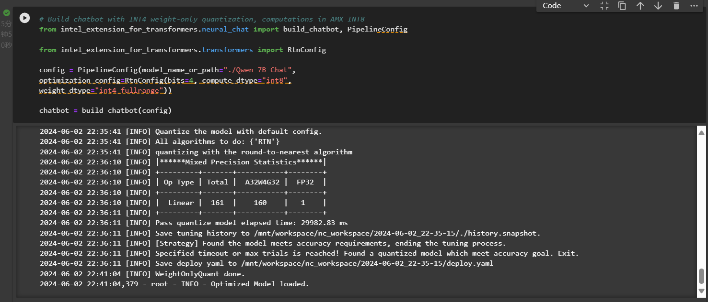
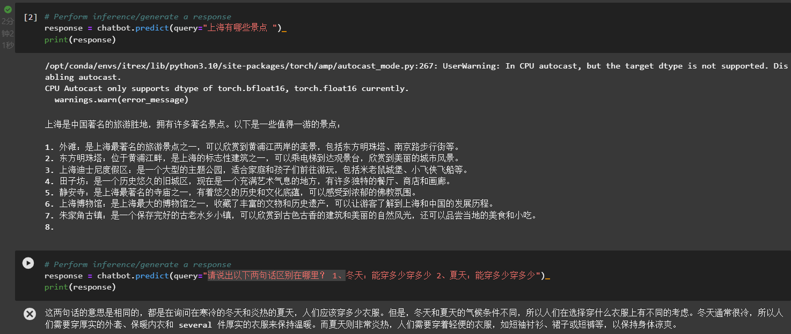
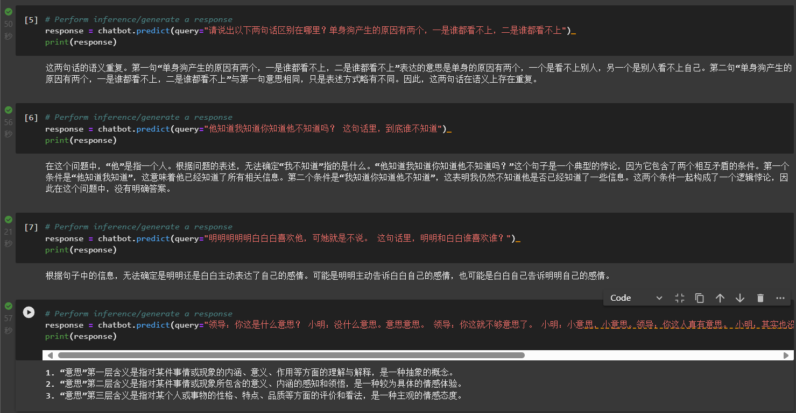
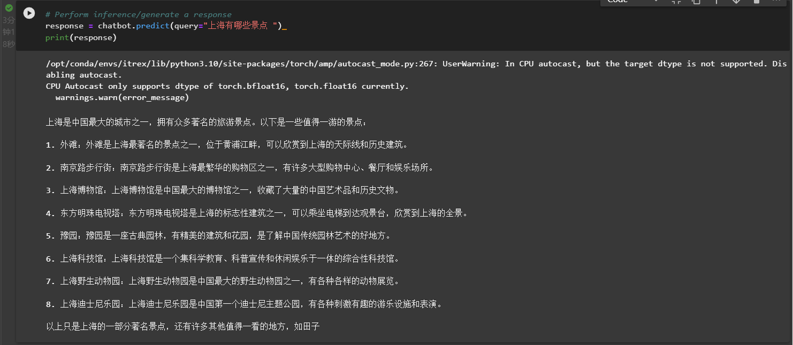
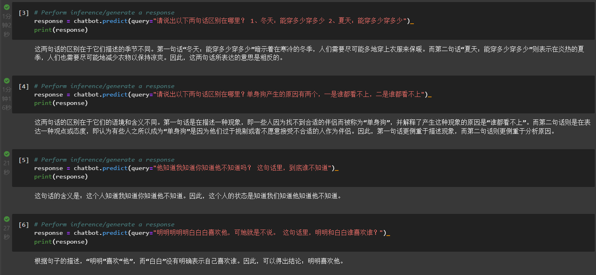
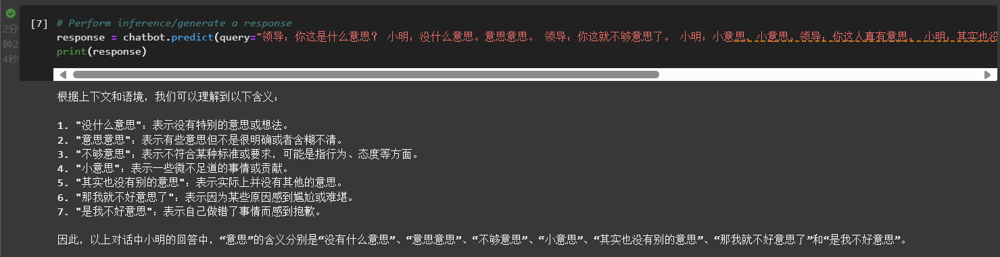

# Assignment 4 大语言模型部署体验

## 实验目的原理

本实验的目的旨在部署并运用大型语言模型（LLM）进行聊天机器人的构建和使用。

1. **环境隔离与复现**：实验中创建特定的虚拟环境（如使用 Conda 管理的环境）是为了确保所有实验都在一个预定义和控制的环境中运行。这种做法避免了不同实验之间的相互影响，并确保实验结果的可复现性。

2. **模型量化**：量化是将模型权重和计算从浮点数转换为低位宽度整数（如 INT8 或 INT4）的过程。这一过程可以显著减少模型的内存占用和计算需求，使得模型在资源有限的设备上也能有效运行。实验中采用量化，是为了优化模型在实际部署中的性能和成本效益。

3. **模型下载与部署**：实验涉及从预设源下载预训练的大语言模型。这些模型通常包含数十亿参数，能够处理复杂的自然语言处理任务。通过在云环境中部署这些模型，可以利用更强大的计算资源来执行大规模的语言理解和生成任务。

4. **应用实现与测试**：部署的模型被应用于具体的任务（如构建聊天机器人），这不仅测试了模型的功能性，也展示了模型在实际应用中的表现。通过输入具体问题并评估模型的回答，可以评估模型的实用性和准确性。

整个部署过程不仅涉及技术操作，还涉及对模型性能的优化和验证，确保模型既能满足实验要求，也适应实际应用的需要。这些原理共同保障了大语言模型在现实世界应用中的有效性和效率。

## 实验步骤

1. 环境配置：

    在云服务器上配置运行环境，通过创建新的工作环境目录，并下载及解压运行环境镜像文件。这一步骤确保了实验环境的一致性和隔离性，使得实验不受其他环境设置的影响。

2. 模型下载：

    下载需要的语言模型文件到工作目录。这些模型通常是预先训练好的，并可以根据实验需要选择不同的模型。

3. 构建聊天机器人：

    使用特定的库和配置（如 INT4 量化和 INT8 计算）来构建聊天机器人。量化是一种减少模型大小和计算需求的技术，可以加快模型推理速度，降低运行成本。

4. 模型使用：

    运行构建好的聊天机器人，输入问题并接收模型生成的回答。这一步展示了模型如何在实际应用中被用来生成对话和回答问题。

## 测试结果

### 测试用例
Question 1: 上海有哪些景点

Question 2: 请说出以下两句话区别在哪里？

    1、冬天：能穿多少穿多少 2、夏天：能穿多少穿多少

Question 3: 请说出以下两句话区别在哪里？

    单身狗产生的原因有两个，一是谁都看不上，二是谁都看不上

Question 4: 他知道我知道你知道他不知道吗？ 这句话里，到底谁不知道？

Question 5: 明明明明明白白白喜欢他，可她就是不说。 这句话里，明明和白白谁喜欢谁？

Question 6: 领导：你这是什么意思？ 小明：没什么意思。意思意思。 领导：你这就不够意思了。 小明：小意思，小意思。领导：你这人真有意思。 小明：其实也没有别的意思。 领导：那我就不好意思了。 小明：是我不好意思。请问：以上“意思”分别是什么意思。

### ChatGIM结果

### Qwen-78-Chat结果

## 对比分析

### 共同点

1. **技术基础**：两者都基于大规模的神经网络架构，利用大量的数据进行训练，能够理解和生成复杂的自然语言。

2. **用途**：主要用于自然语言理解和生成，特别是在生成对话响应方面具有较强的能力。

3. **部署环境**：两者均可以在现代的计算环境中部署，如通过云服务，提供API接口进行交互。

### 不同点

1. 响应风格和内容：

 - ChatGLM3：回答倾向于提供多种选项和详细的解释，显示了在处理具体信息（如上海的旅游景点）和进行语言分析时的细致和深入。
 - Qwen-78-Chat：更倾向于直接、简洁的回答，例如在处理语义分析时直接列出了可能的含义。

2. 语言理解能力：

 - ChatGLM3：在理解复杂句子和多层次含义方面表现得较为全面，例如在解析复杂的语句结构时给出详细分析。
 - Qwen-78-Chat：似乎更侧重于快速响应和直接的语义提取，可能在一些情况下缺乏深入的语境理解。

### 各自特色

1. ChatGLM3：

 - 提供详细且多样的信息，适合需要多选项或深入分析的场景。
 - 对复杂语句的处理能力强，能够解析和反馈多层次的信息，适合高级语言理解任务。

2. Qwen-78-Chat：

 - 响应速度快，生成的内容更为简洁，适合快速交互的应用场景。
 - 简洁的输出可能更适合日常对话和简单查询，用户体验可能更为直接。

### 结论与使用建议

如果你需要进行深入的语言理解和多角度分析，ChatGLM3可能是更好的选择。而如果你需要快速响应和高效交互，Qwen-78-Chat可能会更符合需求。总的来说，模型的选择应基于特定任务的需求来决定。